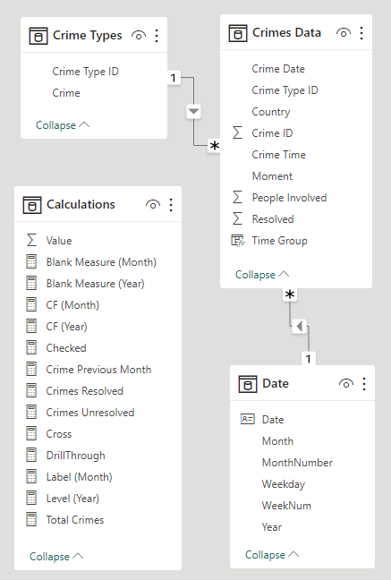
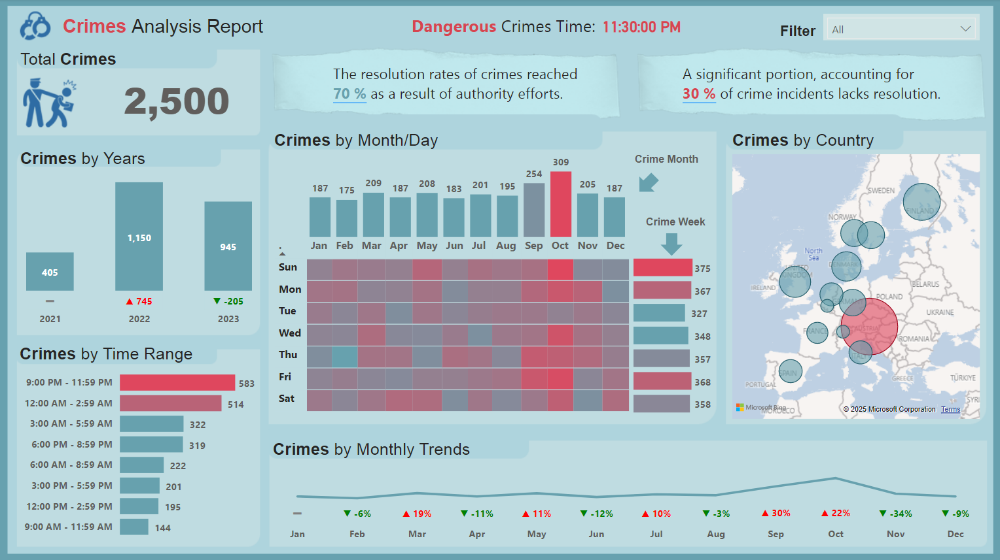

# Crime Analysis Report

## Project Objective
In this project, total crimes will be analysed by year, month and day. Insights into crime distribution over the year-over-year and month-over-month will also be analysed. Crime occurrences within specific time intervals will also be explored. Crime occurrences by country will also be categorised. Based on these analyses, the resolution rate of crimes and unresolved crimes will be highlighted. And the specific time periods during the day associated with a higher and lower frequency of crimes will be pinpointed.

## Dataset used
<a href="Crimes Data.xlsx" >Crimes Data</a>

<a href="Other Data.xlsx" >Others Data</a>

## Dashboard Tasks
1. Total Crimes:
   - Sum of all reported crimes in the dataset.

2. Crime Distribution by Year and Yearly Changes:
   - Analysis of crimes categorized by year, including insights into the year-over-year changes.

3. Crimes by Time Range (e.g., 3:00 AM to 5:59 AM):
   - Exploration of crime occurrences within specific time intervals, providing a detailed breakdown.

4. Hitmap Showing Crime Distribution by Weekdays and Months:
   - Visualization using a hitmap to illustrate how crimes are distributed across weekdays and months.

5. Crimes by Country:
   - Examination of crimes categorized by the country where they occurred.

6. Total Resolved and Unresolved Crimes:
   - Distinction between resolved and unresolved crimes, offering an overview of the overall resolution rate.

7. Monthly Crime Trend with Percentage Variance:
   - Analysis of the monthly crime trend, accompanied by the percentage variance to highlight fluctuations.

8. Identification of the Most Dangerous Time of the Day:
   - Exploration to pinpoint the specific time periods during the day associated with a higher frequency of crimes.

## Data Model

## Dashboard

<a href="Crime Analysis Report.pbix" > Crime Analysis Dashboard </a>

## Conclusion
- The resolution rate for crimes reached 70% as a result of the authority's efforts, while 30% of crime incidents lack resolution. 
- The overall crimes in 2022 increased by 745 from the previous year, but decreased in 2023 by 205. In general, October has the highest crime rates of the year, and Sunday observes the most criminal activities over the week.
- Austria has the highest crime records of 879 among all the countries. 
- The most dangerous crime time of the day is identified as 11:30 pm.   

